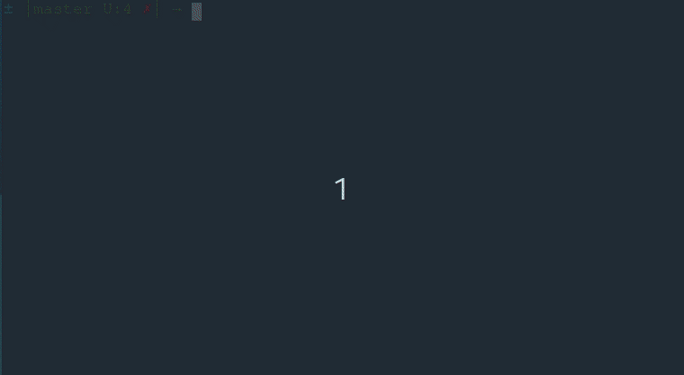

# rustymusic

## Play compositions in Hindustani music

### Demo

### Swar Notations

- `shuddh` (or pure) swars are represented as `sa`, `re` and so on.
- `komal` (or flat) swars are prefixed by an underscore, e.g. `_re`
- `tivra` (or sharp) swars are shown with an apostrophe, e.g. `Ma'`
- `mandra` (or lower octave) saptak swars are prefixed by a dot, e.g. `.dha`. 
  A mandra komal swar is then prefixed by `_.`, e.g. `_.Ni`
- `taar` (or higher octave) saptak swars are suffixed by a dot, e.g. `sa.`
- swars played for longer than a `matra` (or beat) is ornamented with a dash, e.g. `re - ` indicates playing
  of the swar `re` for two matras.
- two swars sharing a matra is split by a `:`, e.g. `sa:re` indicates `sa` and `re` are each played for
  half a matra. A swar played for half a matra is shown as `sa:`. 

Many of the above notations should already be familiar to classical Hindustani musicians,
some I have had to change for ease of use as `strings` within my program.

All the compositions cited in this repository have been provided by my
Guruji _Pandit Vijay Jagtap_ (https://www.vijayjagtap.com). Without his invaluable guidance,
this implementation wouldn't have been possible.

### Usage

There are three options:

- play a raag (`-r <raag>`), currently raag `bhupali`, `durga`, `yaman` and `hamsadhwani` are supported
- play swars from a file (`-f <file>`). See files in `config` directory.
- play random swars (`-z <N>`), where N indicates number of random swars to play. This option is useful for vocal exercise.

